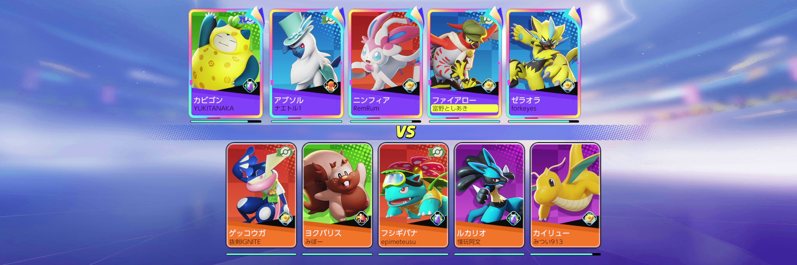

pokemon_unite.py

---
機能

OBSにPokemon Uniteのローディング画面が表示されたとき、録画ファイルを分割する。



このスクリプトはローディング画面中央のvs表示を検出している。

---
使い方

1. NoxとOBSを起動する
2. OBSで録画を始める
3. ポケモンユナイトで遊ぶ

---
インストール

* Nox Player
* Pokémon UNITE
* Python 3.8が動くOBS https://twitter.com/futabachannel/status/1475277367602212864
* norihiro/obs-screenshot-plugin https://github.com/norihiro/obs-screenshot-plugin
* Python 3.8.10 (x64)
* tesserocr
* tessdataをAppData\Local\Programs\Python\Python38\tessdataに置く
* その他のPythonパッケージ

````
>pip list
Package       Version
------------- --------
numpy         1.21.5
opencv-python 4.5.4.60
Pillow        8.4.0
pip           21.3.1
setuptools    56.0.0
tesserocr     2.5.2
````

---
Nox設定

解像度をカスタムで 2400x800 にする

---
OBS設定

1. OBSを起動し [設定] 押下
2. 左ペイン [映像] 押下
3. 基本(キャンバス)解像度 "2400x800" を指定
4. 出力(スケーリング)解像度 "2400x800" を指定
5. sourceにscreenshot filterを加え、shared memory "POKEMON_UINTE"に出力 

---
スクリプトインストール

1. c:\src\unite に本スクリプト一式を置く
2. OBSを起動し [ツール] - [スクリプト] 押下
3. [Pythonの設定] タブを開き、 [Python インストールパス (64bit)] を指定
4. [スクリプトタブ] を開き 、[＋]押下し、c:\src\unite\pokemon_unite.py を指定


